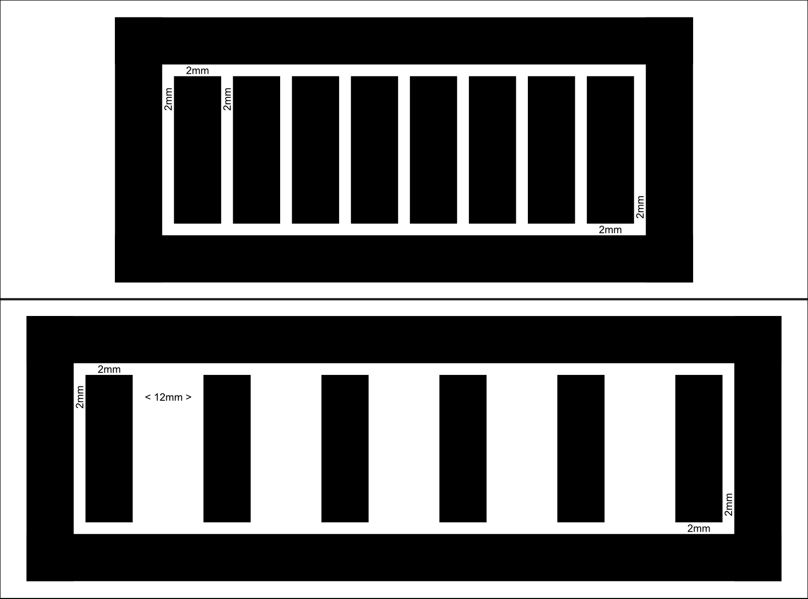

# 基於日式機台的觸控器

[English version](README.md) | 繁體中文版本 (Traditional Chinese version)

繁體中文版本由 `phi4:14b` 進行翻譯 + 人工審查修改以增進效率

## 目錄


- [基於日式機台的觸控器](#基於日式機台的觸控器)
  - [目錄](#目錄)
  - [BOM](#bom)
  - [第三方程式庫](#第三方程式庫)
  - [感測概念、PCB 設計與尺寸參考（日文）](#感測概念pcb-設計與尺寸參考日文)
  - [使用方式](#使用方式)
    - [軟體前置條件](#軟體前置條件)
    - [步驟](#步驟)
    - [啟用鍵盤輸入](#啟用鍵盤輸入)
  - [原型觸控板製作步驟](#原型觸控板製作步驟)
  - [程式流程圖](#程式流程圖)
    - [Config](#config)
    - [執行程式（`CY8C_code.ino`）](#執行程式cy8c_codeino)
  - [發展階段](#發展階段)
  - [AI 使用與歸屬](#ai-使用與歸屬)

## BOM
<details>
<summary>使用測試PCB</summary>

1. 測試PCB [主板型號B](./PCB/TestPCB/TestMotherboardB.kicad_pcb) × 1
2. 測試PCB [子板型號B](./PCB/TestPCB/TestChildboardB.kicad_pcb) × 1
   1. CY8CMBR3116 與 [DIP轉接版](./PCB/CY8CMBR3116_PCB/CY8CMBR3116_PCB.kicad_pro) × 1 `! KiCad 專案是使用版本 9 或 8 建立的。`
   2. 0.1uF × 2
   3. 1uF × 1
   4. 2.2nF X7R × 1
   5. 4.7kΩ × 2
   6. 560Ω × 16
3. IR LED `! 功能尚未實現`
4. IRM-3638 IR 接收器 `! 功能尚未實現`
5. RP2040 Zero × 1
   （下文稱 RP2040）
</details>

<details>
<summary>使用原型觸控板</summary>

1. CY8CMBR3116 與 DIP 轉接版 × 1
   1. 0.1uF × 2
   2. 1uF × 1
   3. 2.2nF × 1
   4. 4.7kΩ × 2
2. 電容式觸控板 × 1 組
   1. 單芯線 × 7/組 或 9/組，取決於[你選擇的版本](#原型觸控板製作步驟)
   2. 雙面導電銅箔膠帶（看下方製作方法）
   3. 560Ω × 6/組 或 8/組，取決於[你選擇的版本](#原型觸控板製作步驟)
3. IR LED `! 功能尚未實現`
4. IRM-3638 IR 接收器 `! 功能尚未實現`
5. RP2040 Zero × 1
   （下文稱 RP2040）
</details>

## 第三方程式庫
特別感謝以下程式庫的作者：
- [CypressCY8CMBR3116](https://github.com/sebastianregelmann/CypressCY8CMBR3116) 由 GitHub [@sebastianregelmann](https://github.com/sebastianregelmann)
    安裝方式：
    1. 將專案下載為 `.zip` 格式
    2. 將 `.zip` 改名為 `CypressCY8CMBR3116.zip`
    3. Arduino IDE 2 > Sketch > Library > Include Library > Add .ZIP Library...
    4. 找到並選擇該 `.zip` 安裝程式庫。
    5. **注意**：當前版本的程式庫需要編輯 `.cpp` 檔案以正確執行。以下是修改方法：
       1. 瀏覽至第 699 行，其中 `uint8_t CY8CMBR3116::activateSettings() {`。
       2. 在 `uint8_t error = calculateCRC();` 後新增一行並輸入 `delay(250);`。
       3. 在 `error = applyRegister();` 和 `error = resetIC();` 各後添加一行，分別輸入 `delay(200);`。此操作可增加設定正確激活的可能性。
- [Arduino-Pico](https://github.com/earlephilhower/arduino-pico)
  開發 RP2040-Zero 使用 Arduino IDE 和 Arduino 程式時使用。  
  安裝板：
  1. `Arduino IDE 2` > `Arduino IDE` > `Preference` > `Additional boards manager URLs:`
     在末尾加入以下內容：
     ```
     https://github.com/earlephilhower/arduino-pico/releases/download/global/package_rp2040_index.json
     ```
  2. `Arduino IDE 2` > `Boards Manager`
  搜尋「RP2040」，安裝「Raspberry Pi Pico/RP2040/RP2350」 by 「Earle F. Phithower, III」。
  - Adafruit TinyUSB 程式庫在安裝該板時會自動安裝。  
  與電腦的 USB 通信使用 [CY8C_code/NKRO_TinyUSB.h](./Codes/forCY8C/CY8C_code/NKRO_TinyUSB.h) 檔案。
  ***不過***，在上傳 [CY8C_code.ino](./Codes/forCY8C/CY8C_code/CY8C_code.ino) 之前，請到 `Arduino IDE 2` > `Tools` > `USB Stack` > `Adafruit Tiny USB` 切換 USB 功能。

## 感測概念、PCB 設計與尺寸參考（日文）
[完整的尺寸和資訊](https://mizucoffee.blogspot.com/2018/05/1-chunithm.html) （部落格，多頁）  
[詳細的尺寸和感測方法](https://gist.github.com/mizucoffee/2f6263656d174fb2284a9e49c44bfabc)  
[觸控板（地面滑條）長度](https://detail.chiebukuro.yahoo.co.jp/qa/question_detail/q14172146159)  
[感測方法](https://x.com/QmanEnobikto/status/2049293495903629316) （較新的信息作為確認）

## 使用方式
### 軟體前置條件
- Arduino IDE（Windows 11 & macOS Tahoe 測試版本為 v.2.3.8）
  請確保安裝上述提及的第三方程式庫（可以透過 .zip 安裝或者在 Arduino IDE 的 Library Manager 中安裝，並確認你是安裝 "CypressCY8CMBR3116 by sebastianregelmann"）。

### 步驟
1. 將 CY8CMBR3116 連接到面包板上，注意 I²C SDA → Pin 0, I²C SCL → Pin 1。確認這些引腳已經通過 4.7kΩ 上拉電阻進行了上拉。
2. 將 RP2040 透過 USB 線與電腦連接。
3. 上傳 [ConfigCode.ino](./CY8C_code/ConfigCode/ConfigCode.ino)
4. 上傳 [CY8C_code.ino](./CY8C_code/CY8C_code/CY8C_code.ino)
5. 開啟序列監視器並觸控觸控板。

### 啟用鍵盤輸入
將 RP2040 的 Pin 8 接地以啟用鍵盤輸入功能。

## 原型觸控板製作步驟
準備一塊木板，印出下方影像（確保黑線寬度在 8mm），並使用白色粘合劑貼上紙張。

選擇一種設計來測試結果。中間的棒狀是觸控按鈕，外圍的環形為接地。6 個觸控按鈕的版本適合用於 PC 上的節奏類遊戲。
決定你想測試的模式後，將黑色區域覆蓋上寬度為 8mm 的雙面導電銅箔帶並在以下引腳進行焊接：
- 觸控按鈕 → CY8CMBR3116 的 CS0 ~ CS5（通過 560Ω 電阻）。（若選擇 8 個按鈕，則為 CS0 ~ CS7）
- 接地 → RP2040 的 GND
注意到觸控板與接地環之間的距離是可以被感測到的最大範圍。

## 程式流程圖
目前僅有中文版本可用。
### Config

### 執行程式（`CY8C_code.ino`）



## 發展階段
- [X] 設定
- [X] 開始感測並印出有意義的訊息（≈ MVP）
- [X] 引入 `HID-Project.h`
- [X] 測試多個按鈕
- [X] 測試 IR 代碼
- [X] 改善延遲 → 延遲現在從約 70~75 毫秒改善到約 40 毫秒。 （更新日期：2026 年 5 月 11 日，第一次更新）
- [X] 完成 IR 代碼 <!-- TODO: 要進行測試 -->
- [X] 印刷並測試 PCB
- [ ] 最終化 PCB 設計
      將 IC CY8CMBR3116 整合到 PCB 中，以及將 RP2040 同時整合到 PCB。
      找出 IR 感測與主板連接的解決方案。
- [ ] 最終化外殼
- [ ] 精緻化 README 和文件並公開此專案庫
   - [ ] 將圖片和內容上傳到 Imgur
   - [ ] 將 CY8CMBR3116 在相同或不同 Repo 中的使用方式文件化
   - [X] 公開專案庫
   - [ ] 完成最終 README

---
## AI 使用與歸屬
此項目整合了人工智慧協助開發工具以優化工作流程和效率：
* **代碼補全**：GitHub Copilot 和 Continue + `granite4:7b-a1b-h`（VS Code）用於實時自動完成。
* **架構鋪設**：利用 `phi4:14b` 和 `phi4-reasoning:14b` 生成初始基本架構代碼並在緩存遠程環境中驗證邏輯，因硬體訪問受限。
* **資訊驗證**：
  * Google Gemini 用於概念研究和文件驗證（專案原始碼未上傳至 Gemini 平台）
  * 使用付費 API 金鑰在 Google AI Studio 上的 Gemini 模型，以確保數據有法律上的隱私保障。
所有由 AI 生成的程式碼均已手動審核、重構並測試，以確保邏輯完整性和專案特定要求。