# 基於日系街機設計的觸控控制器

[English version](README.md) | 繁體中文版本 (Traditional Chinese version)

## 目錄

- [基於日系街機設計的觸控控制器](#基於日系街機設計的觸控控制器)
  - [目錄](#目錄)
  - [物料清單 (BOM)](#物料清單-bom)
  - [第三方函式庫](#第三方函式庫)
  - [感應原理、PCB 設計與尺寸參考 (日文)](#感應原理pcb-設計與尺寸參考-日文)
  - [使用方法](#使用方法)
    - [軟體預備條件](#軟體預備條件)
    - [步驟](#步驟)
    - [啟用鍵盤輸入](#啟用鍵盤輸入)
  - [原型觸控板製作步驟](#原型觸控板製作步驟)
  - [程式流程圖](#程式流程圖)
    - [配置 (Config)](#配置-config)
    - [運行程式 (`CY8C_code.ino`)](#運行程式-cy8c_codeino)
  - [開發階段](#開發階段)
  - [AI 使用說明與歸屬](#ai-使用說明與歸屬)

## 物料清單 (BOM)

<details>

<summary>使用測試用 PCB</summary>

1. 測試用主板 Type B [motherboard type B](./PCB/TestPCB/TestMotherboardB.kicad_pcb) × 1
1. 測試用子板 Type B [childboard type B](./PCB/TestPCB/TestChildboardB.kicad_pcb) × 1
   1. CY8CMBR3116 搭配 [DIP 轉接板](./PCB/CY8CMBR3116_PCB/CY8CMBR3116_PCB.kicad_pro) × 1 `! KiCad 專案是使用 KiCad 版本 9 或 8 建立的。`
   2. 0.1uF × 2
   3. 1uF × 1
   4. 2.2nF X7R × 1
   5. 4.7kΩ × 2
   6. 560Ω × 16
2. IR LED `! 功能尚未實作`
3. ~IRM-3638~ TSSP58038 紅外線接收器 `! 功能尚未實作，可能會更換為 TSSP58038`
4. RP2040-Zero × 1
   (下文簡稱為 RP2040)

</details>

<details>

<summary>使用原型觸控板</summary>

1. CY8CMBR3116 搭配 DIP 轉接板 × 1
   1. 0.1uF × 2
   2. 1uF × 1
   3. 2.2nF × 1
   4. 4.7kΩ × 2
2. 電容式觸控墊 × 1 套
   1. 雙面導電銅箔膠帶 (製作教學請見下方)
   2. 560Ω × 6/套 或 8/套 (視您選擇的[設計方案](#原型觸控板製作步驟)而定)
3. IR LED `! 功能尚未實作`
4. ~IRM-3638~ TSSP58038 紅外線接收器 `! 功能尚未實作，可能會更換為 TSSP58038`
5. RP2040-Zero × 1
   (下文簡稱為 RP2040)

</details>

## 第三方函式庫

非常感謝以下函式庫的作者：

- [CypressCY8CMBR3116](https://github.com/sebastianregelmann/CypressCY8CMBR3116) 作者為 GitHub [@sebastianregelmann](https://github.com/sebastianregelmann)
    安裝函式庫的方法：
  1. 下載該儲存庫的 `.zip` 檔。
  2. 將 `.zip` 檔重新命名為 `CypressCY8CMBR3116.zip`。
  3. Arduino IDE 2 > Sketch > Library > Include Library > Add .ZIP Library...
  4. 找到該 .zip 檔並選擇它以安裝函式庫。
  5. !重要！目前版本的此函式庫需要修改 `.cpp` 檔案才能正常運行。修復方法如下：
      1. 找到第 699 行，即 `uint8_t CY8CMBR3116::activateSettings() {` 的位置。
      2. 在 `uint8_t error = calculateCRC();` 之後，新增一行並寫入 `delay(250);`。
      3. 在 `error = applyRegister();` 和 `error = resetIC();` 之後，各新增一行並寫入 `delay(200);`。

      這將提高設定成功啟動的機率。

- [Arduino-Pico](https://github.com/earlephilhower/arduino-pico)
  用於透過 Arduino IDE 與 Arduino 程式碼開發 RP2040-Zero。  
  安裝開發板：
  1. `Arduino IDE 2` > `Arduino IDE` > `Preference` > `Additional boards manager URLs:`
   在結尾添加以下內容：
   ```
   https://github.com/earlephilhower/arduino-pico/releases/download/global/package_rp2040_index.json
   ```
  2. `Arduino IDE 2` > `Boards Manager`
  搜尋 "RP2040"，安裝由 "Earle F. Phithower, III" 提供的 "Raspberry Pi Pico/RP2040/RP2350"。
  - 安裝開發板時會自動安裝 Adafruit TinyUSB 函式庫。
  與電腦進行 USB 通訊的函式庫位於 [CY8C_code/NKRO_TinyUSB.h](./Codes/forCY8C/CY8C_code/NKRO_TinyUSB.h)。  
  ***但是***，在燒錄 [CY8C_code.ino](./Codes/forCY8C/CY8C_code/CY8C_code.ino) 之前，請前往 `Arduino IDE 2` > `Tools` > `USB Stack` > `Adafruit Tiny USB` 切換 USB 功能。

## 感應原理、PCB 設計與尺寸參考 (日文)

[完整尺寸與資訊](https://mizucoffee.blogspot.com/2018/05/1-chunithm.html) (部落格，多頁面)  
[詳細尺寸與感應方法](https://gist.github.com/mizucoffee/2f6263656d174fb2284a9e49c44bfabc)  
[觸控面板 (地面滑條) 長度](https://detail.chiebukuro.yahoo.co.jp/qa/question_detail/q14172146159)  
[感應方法](https://x.com/QmanEnobikto/status/2049293495903629316) (較新的確認資訊)  


## 使用方法

### 軟體預備條件

- Arduino IDE (已在 Windows 11 & macOS Tahoe 上測試 v.2.3.8)
  請確保已安裝上述提到的第三方函式庫 (透過 .zip 安裝或在 Arduino IDE 的 Library Manager 中安裝，並確保安裝的是 "CypressCY8CMBR3116 by sebastianregelmann"。)

### 步驟

1. 在麵包板上正確接線您的 CY8CMBR3116。I²C SDA → Pin 0, I²C SCL → Pin 1。確保這些引腳已使用 4.7kΩ 電阻上拉。
2. 使用 USB 線將 RP2040 連接到電腦。
3. 上傳 [ConfigCode.ino](./CY8C_code/ConfigCode/ConfigCode.ino)。
4. 上傳 [CY8C_code.ino](./CY8C_code/CY8C_code/CY8C_code.ino)。
5. 打開序列埠監控器 (Serial Monitor) 並觸碰觸控墊。

### 啟用鍵盤輸入

將 RP2040 的 Ground Pin 8 接地即可啟用鍵盤輸入。

## 原型觸控板製作步驟

準備一塊木板，列印下圖（請務必確保圖中黑線的厚度為 8mm），並使用白膠將紙張貼上。


選擇其中一種設計來測試結果。中間的桿狀部分是觸控按鈕，外圈是接地 (Ground)。6 按鈕設計非常適合在 PC 上玩節奏遊戲。

決定好要測試的圖案後，用 8mm 寬的銅箔膠帶覆蓋黑色區域，並將電線焊接至以下引腳：

- 觸控按鈕 → 透過 560Ω 電阻連接至 CY8CMBR3116 的 CS0 ~ CS5。 (如果您選擇 8 按鈕設計，則為 CS0 ~ CS7)
- 接地 (Ground) → 連接至 RP2040 的 GND。

請注意，觸控墊與接地環之間的間距，即為手指與觸控墊之間能被偵測到的最大距離。

## 程式流程圖

目前僅提供中文版本。

### 配置 (Config)


### 運行程式 (`CY8C_code.ino`)



## 開發階段

- [x] 配置 (Configuration)
- [x] 開始感應並輸出具備意義的資訊 (≈ MVP)
- [x] 引入 `HID-Project.h`
- [x] 測試多個按鈕
- [x] 測試 IR Code
- [x] 優化延遲 → 延遲已從約 70~75ms 改善至約 40ms。(2026 年 5 月 11 日第一次更新)
- [x] 完成 IR Code (待測試)
- [x] 列印並測試 PCB
- [x] 定案 PCB 設計
      將 CY8CMBR3116 IC 本身直接整合進 PCB，並將 RP2040 也整合進 PCB 中。
      尋找 IR 感應連接到主板的解決方案。
- [ ] 定案外殼
- [ ] 優化 README 與文件並公開儲存庫
   - [ ] 將照片與封閉原始碼圖片上傳至 Imgur
   - [ ] 在同一個或另一個儲存庫中記錄 CY8CMBR3116 的使用方法
   - [x] 公開儲存庫
   - [ ] 優化最終版 README

---

## AI 使用說明與歸屬

本專案結合了 AI 輔助開發工具，以優化工作流程與效率：

* **程式碼補全**：使用 GitHub Copilot 與 Continue + `granite4:7b-a1b-h` (VS Code) 進行即時自動補全。
* **架構搭建**：利用 `phi4:14b` 與 `phi4-reasoning:14b` 在硬體存取受限的遠端環境中生成初始樣板程式碼並驗證邏輯。
* **資訊驗證**：
  * 使用 Google Gemini 進行概念研究與文件驗證（未將專案原始碼上傳至 Gemini 平台）。
  * 在 Google AI Studio 使用 Gemini 模型與 Gemma 4 模型，並使用付費 API 金鑰以確保法律數據隱私。

所有由 AI 生成的程式碼均經過人工審查、重構與測試，以確保邏輯完整性與符合專案特定需求。